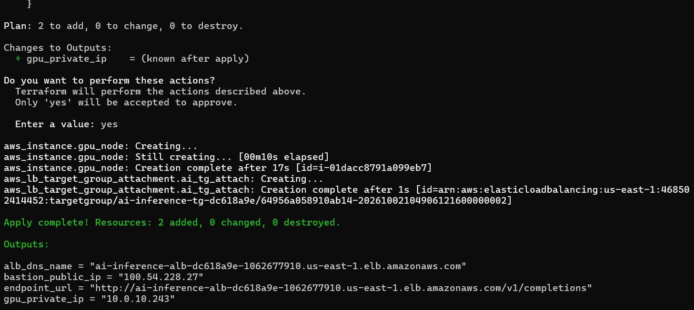
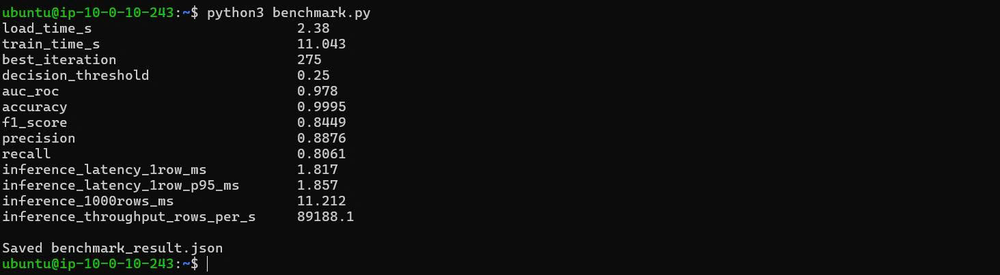
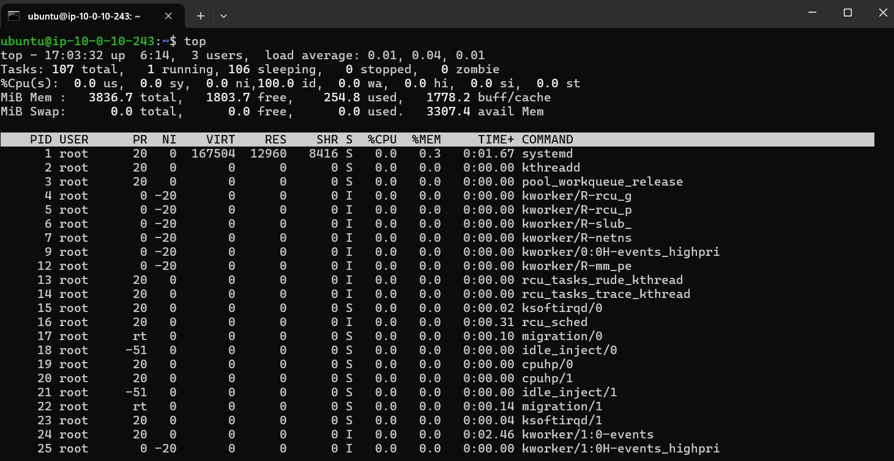
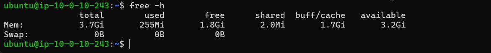
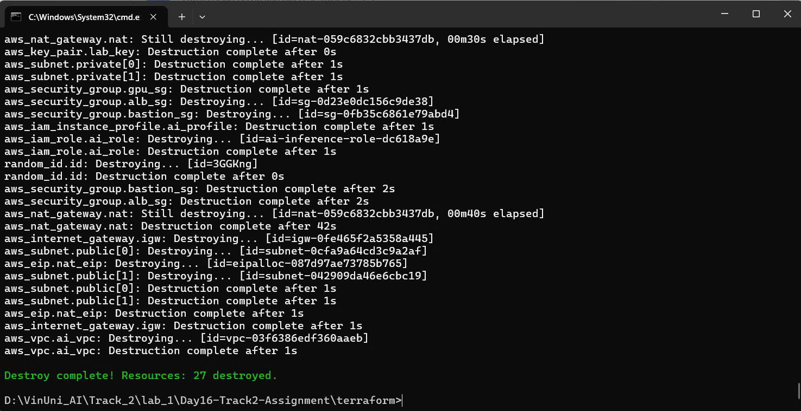
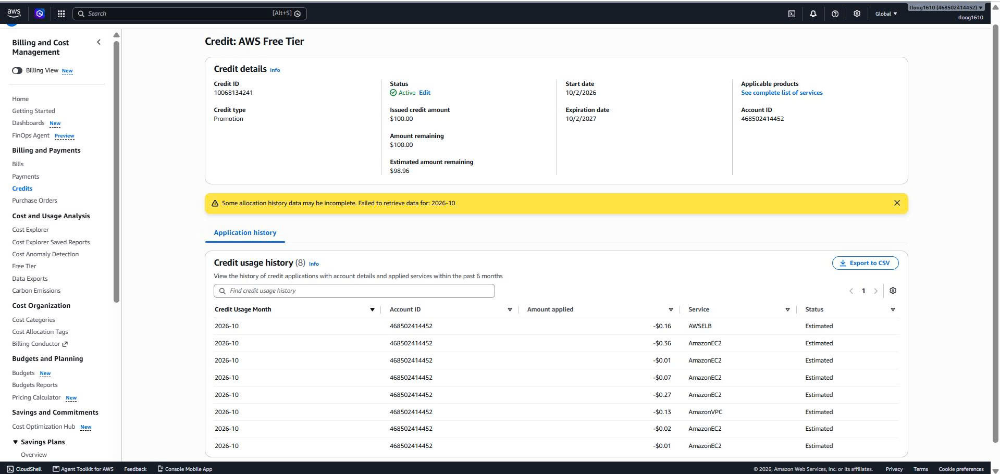

# Báo cáo LAB 16: Cloud AI Environment Setup (AWS — luồng CPU + LightGBM)

**Hạ tầng:** Terraform trên AWS `us-east-1` — VPC private, Bastion `t3.micro`, Compute Node `t3.medium` (2 vCPU / 4 GB RAM), NAT Gateway, ALB.
**Bài toán:** Phát hiện gian lận trên bộ Credit Card Fraud Detection (284,807 giao dịch, 492 gian lận ~ 0.17%).
**Mô hình:** `LGBMClassifier` (learning_rate 0.02, early stopping 100 vòng theo AUC trên tập validation, không dùng class weight, ngưỡng quyết định 0.25 chọn tối ưu F1 trên validation). Mã nguồn: [`benchmark.py`](benchmark.py).

## Kết quả benchmark

| Metric | Kết quả |
|---|---|
| Thời gian load data | 2.38 s |
| Thời gian training | 11.043 s |
| Best iteration | 275 |
| AUC-ROC | 0.978 |
| Accuracy | 0.9995 |
| F1-Score | 0.8449 |
| Precision | 0.8876 |
| Recall | 0.8061 |
| Inference latency (1 row) | 1.817 ms (p95: 1.857 ms) |
| Inference throughput (1000 rows) | 11.212 ms (~89,188 rows/s) |

File kết quả đầy đủ: [`benchmark_result.json`](benchmark_result.json).

## Nhận xét

1. **Training time:** Huấn luyện 275 cây trên ~182k dòng chỉ mất ~11 giây trên `t3.medium` 2 vCPU — với dữ liệu dạng bảng cỡ này, CPU nhỏ là đủ, không cần GPU.
2. **AUC-ROC 0.978** cho thấy mô hình phân tách tốt giao dịch gian lận và hợp lệ; mô hình bắt được ~81% ca gian lận (Recall) với ~89% cảnh báo là đúng (Precision), F1 = 0.845.
3. **Accuracy 0.9995 không phản ánh chất lượng** vì dữ liệu mất cân bằng nặng (đoán toàn "hợp lệ" đã đạt 0.998), nên cần đánh giá bằng AUC, F1, Precision/Recall.
4. **Xử lý mất cân bằng:** Lần chạy đầu dùng `scale_pos_weight` ~577 khiến mô hình dừng sớm ở vòng 10, Precision chỉ 0.055 (F1 0.10). Bỏ class weight và chọn ngưỡng trên tập validation đã nâng F1 lên 0.845.
5. **Inference speed:** Latency ~1.8 ms/dòng, chủ yếu là overhead của pandas/scikit-learn API; dự đoán theo batch đạt ~89k dòng/giây — đủ cho bài toán real-time scoring giao dịch trên CPU.
6. **Chi phí:** Tổng chi phí phát sinh ~$1.03 (EC2 + NAT Gateway $0.74, ALB $0.16, VPC $0.13), được trừ hoàn toàn vào AWS credits nên hoá đơn hiển thị $0.00. NAT Gateway là khoản cố định đáng kể nhất, vì vậy hạ tầng đã được `terraform destroy` ngay sau khi hoàn thành.

## Bằng chứng

| # | Nội dung | Ảnh |
|---|---|---|
| 1 | `terraform apply` thành công |  |
| 2 | Output `python3 benchmark.py` |  |
| 3 | CPU usage (`top`) |  |
| 4 | RAM usage (`free -h`) |  |
| 5 | `terraform destroy` — dọn dẹp tài nguyên |  |
| 6 | AWS Billing / Credits — chi phí phát sinh |  |
